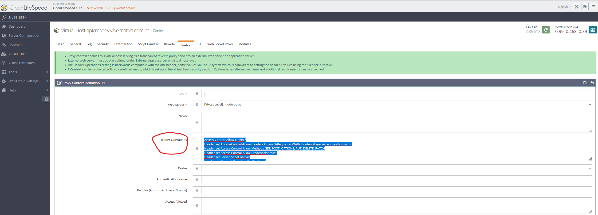

# Solução para Erro de CORS no Servidor

Se você está enfrentando um erro de CORS (Cross-Origin Resource Sharing) em seu servidor, aqui estão alguns trechos de código que podem ajudar a resolver o problema:

## OpenliteSpeed (proxy reverso)

Se estiver usando o OpenLiteSpeed como servidor web, você pode adicionar o seguinte código no serviço de proxy reverso:



Edite ou adicione o "Header Operations" a seguinte linha:

```text
Access-Control-Allow-Origin *
Header set Access-Control-Allow-Headers Origin, X-Requested-With, Content-Type, Accept, authorization
Header set Access-Control-Allow-Methods GET, POST, OPTIONS, PUT, DELETE, PATCH
Header set Access-Control-Allow-Credentials "true"
Header set Server "VibeCriativa"
Header set Content-Type "application/json"
```

## Apache

Se estiver usando o Apache como servidor web, você pode adicionar o seguinte código no arquivo `.htaccess`:
```text
<IfModule mod_headers.c>
    Header set Access-Control-Allow-Origin "*"
    Header set Access-Control-Allow-Headers "Origin, X-Requested-With, Content-Type, Accept, authorization"
    Header set Access-Control-Allow-Methods "GET, POST, OPTIONS, PUT, DELETE, PATCH"
    Header set Access-Control-Allow-Credentials "true"
    Header set Server "VibeCriativa"
    Header set Content-Type "application/json"
</IfModule>
```

## Nginx

Se estiver usando o Nginx como servidor web, você pode adicionar o seguinte código no arquivo de configuração do servidor:
```text
location / {
    if ($request_method = 'OPTIONS') {
        add_header 'Access-Control-Allow-Origin' '*';
        add_header 'Access-Control-Allow-Headers' 'Origin, X-Requested-With, Content-Type, Accept, authorization';
        add_header 'Access-Control-Allow-Methods' 'GET, POST, OPTIONS, PUT, DELETE, PATCH';
        add_header 'Access-Control-Allow-Credentials' 'true';
        add_header 'Server' 'VibeCriativa';
        add_header 'Content-Type' 'application/json';
        add_header 'Content-Length' 0;
        return 204;
    }
}
```

## PHP (swoole)

vá ate o indexpro.php e adicione o seguinte código
após o código psrRequest (isso não é para adicionar no código, é apenas para mostrar onde deve ser adicionado)
```php
$psrRequest = new PsrRequest(
                $swooleRequest,
                $uriFactory,
                $streamFactory,
                $uploadedFileFactory
            );
```
Adicione o seguinte código
```php
 //headser all cors
            $swooleResponse->header('Access-Control-Allow-Origin', '*');
            $swooleResponse->header('Access-Control-Allow-Headers', $swooleRequest->header['access-control-request-headers'] ?? 'Content-Type, authorization, Accept');
            $swooleResponse->header('Access-Control-Allow-Methods', 'GET, POST, PUT, DELETE, OPTIONS');
            $swooleResponse->header('Content-Type', 'application/json');
            $swooleResponse->header('Authorization', '*');
            //Access-Control-Allow-Credentials
            $swooleResponse->header('Access-Control-Allow-Credentials', 'true');
            //set swoole name server
            $swooleResponse->header('Server', 'VibeCriativa');
```

## php (slimFramework)

Se estiver usando o Slim Framework, você pode adicionar o seguinte código no arquivo de configuração do servidor, vá até a pasta "project/functions/slim" e abra o arquivo "appSli.php" e adicione o seguinte código (caso a função '$app->add(function (RequestSlim $request, RequestHandlerSlim $handler)' já exista, adicione apenas o código dentro da função)
```php
$app->add(function (RequestSlim $request, RequestHandlerSlim $handler) {
    try {
        // Verifica se o cabeçalho Authorization está presente na solicitação
        $authorizationHeader = $request->getHeaderLine('authorization');
        // Verifica se o método da solicitação é OPTIONS
        if ($request->getMethod() === 'OPTIONS') {
            // Retorna uma resposta vazia com os cabeçalhos de controle de acesso apropriados
            $response = new slimReponse();
            //authorization
            return $response
                ->withHeader('Access-Control-Allow-Origin', '*')
                ->withHeader('Access-Control-Allow-Headers', 'Content-Type, authorization')
                ->withHeader('Access-Control-Allow-Methods', 'GET, POST, PUT, DELETE, OPTIONS');
        }

        // Passa a solicitação para o próximo middleware
        $response = $handler->handle($request);
         // Adiciona o cabeçalho Authorization à resposta
         if (!empty($authorizationHeader)) {
            $response = $response->withHeader('authorization', $authorizationHeader);
        }
        return $response;
    } catch (Exception $th) {
        log::logs($th->getMessage(), 'server_Slim_Log_error', 'none', 'error', $th->getMessage());
        return $th;
    }
});
```
## Adcionar ao Middleware do Slim Framework
```php

 $response = $response
        ->withHeader('Content-Type', 'application/json')
        ->withHeader('Access-Control-Allow-Origin', '*')
        ->withHeader('Access-Control-Allow-Headers', 'Content-Type')
        ->withHeader('Authorization', '*')
        ->withHeader('Access-Control-Allow-Methods', 'GET, POST, PUT, DELETE, OPTIONS');
```


